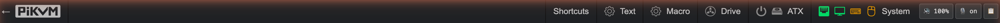
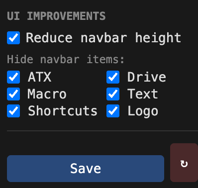
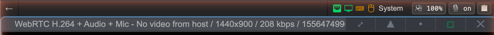
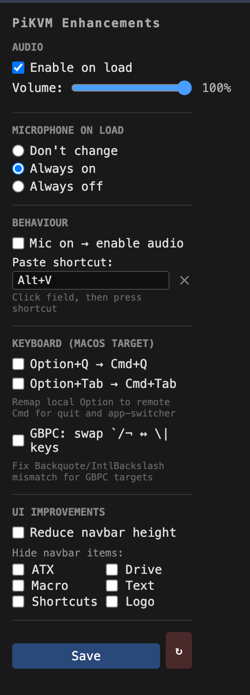

# PiKVM Enhancements

A Chrome extension that enhances the [PiKVM](https://pikvm.org/) web UI with audio/mic controls, keyboard fixes, clipboard paste, and UI customization. Fully self-contained — works with stock PiKVM, no server-side changes needed.

## Features

### Audio & Microphone

PiKVM's own UI [cannot save audio/mic settings](https://docs.pikvm.org/audio/) due to browser autoplay policy — every time you open the page, you have to manually re-enable audio and the microphone. This extension works around that limitation.

- **Auto-enable audio on page load** with configurable default volume
- **Microphone on load**: choose "Don't change", "Always on", or "Always off"
- **Mic-links-audio**: enabling the mic automatically enables audio if it was muted

### Quick Controls

Inline audio, mic, and paste buttons are injected directly into the navbar next to the System menu:



When the navbar is hidden (via PiKVM's ••• toggle), floating buttons appear alongside:

<p align="center">
  
</p>

**Floating panel** (top to bottom): Fullscreen toggle, Normalize (X), PiKVM's ••• menu, Audio, Mic, Clipboard paste.

### Clipboard Paste

Paste text directly into the remote machine with a single shortcut — no need to open PiKVM's text input panel, paste into it, and click send. Press the configurable shortcut (default: **Alt+V**) and the extension reads your clipboard, intercepts the keystroke before PiKVM's HID handler, releases any held modifier keys on the remote, and types the text straight in. A toast notification confirms how many characters were pasted.

### Fullscreen Toggle

Press **F11** to toggle between browser fullscreen and PiKVM's full-tab (stretched) mode. A fullscreen button is also available in the floating panel. Exiting fullscreen automatically restores full-tab mode.

### Keyboard Remaps (macOS Target)

Optional remaps for when the remote machine runs macOS. All default to **off** — enable only the ones you need.

| Remap | What it does |
|-------|-------------|
| **Option+Q → Cmd+Q** | Quit apps on the remote without closing your local Chrome |
| **Option+Tab → Cmd+Tab** | App switcher on the remote (hold Option to keep it open, Tab to cycle) |
| **GBPC key swap** | Fix backtick/backslash mismatch when the remote uses a British PC keyboard layout |

### UI Customization

Reduce navbar height and selectively hide items you don't use (ATX, Drive, Macro, Text, Shortcuts, Logo):

<p align="center">
  
</p>

Before and after — all items hidden with reduced navbar height:



### Live Settings

All settings apply instantly — no page reload needed. Changes made in the popup are broadcast to the content script via `chrome.storage.onChanged`.

### Extension Popup

<p align="center">
  
</p>

## Installation

1. Clone or download this repository:
   ```bash
   git clone https://github.com/guacforlife/pikvm-extension.git
   ```
2. Open `chrome://extensions/` in Chrome (or any Chromium-based browser)
3. Enable **Developer mode** (toggle in the top-right corner)
4. Click **Load unpacked** and select the cloned extension folder
5. Navigate to your PiKVM web UI — the extension activates automatically on any URL matching `/kvm/`

## Usage

1. **Open your PiKVM** in Chrome. The extension injects controls automatically — you'll see a toast notification confirming audio/mic state.
2. **Click the extension icon** in the Chrome toolbar to open the settings popup. Changes take effect immediately (no page reload needed).
3. **Audio/Mic controls** appear inline in the navbar next to "System". When the navbar is hidden, floating buttons appear next to the ••• toggle.
4. **Paste clipboard** to the remote machine using the configured shortcut (default: **Alt+V**), or click the clipboard button.
5. **Toggle fullscreen** with **F11** or the fullscreen button in the floating panel.
6. **Keyboard remaps** (macOS target section) are off by default. Enable them in the popup if your remote machine runs macOS.
7. **Reload button** (&#x21bb; in the popup footer) reloads the extension and all PiKVM tabs — useful during development or after updating.

## Permissions

| Permission | Used for |
|-----------|----------|
| `storage` | Persisting settings across sessions |
| `clipboardRead` | Reading clipboard for the paste shortcut |
| `tabs` | Reloading PiKVM tabs when extension is updated via the reload button |

## Compatibility

Works with any PiKVM instance (V2, V3, V4, DIY) that serves the standard web UI at `/kvm/`. No PiKVM configuration changes, plugins, or server-side modifications required.

## License

GPLv2
